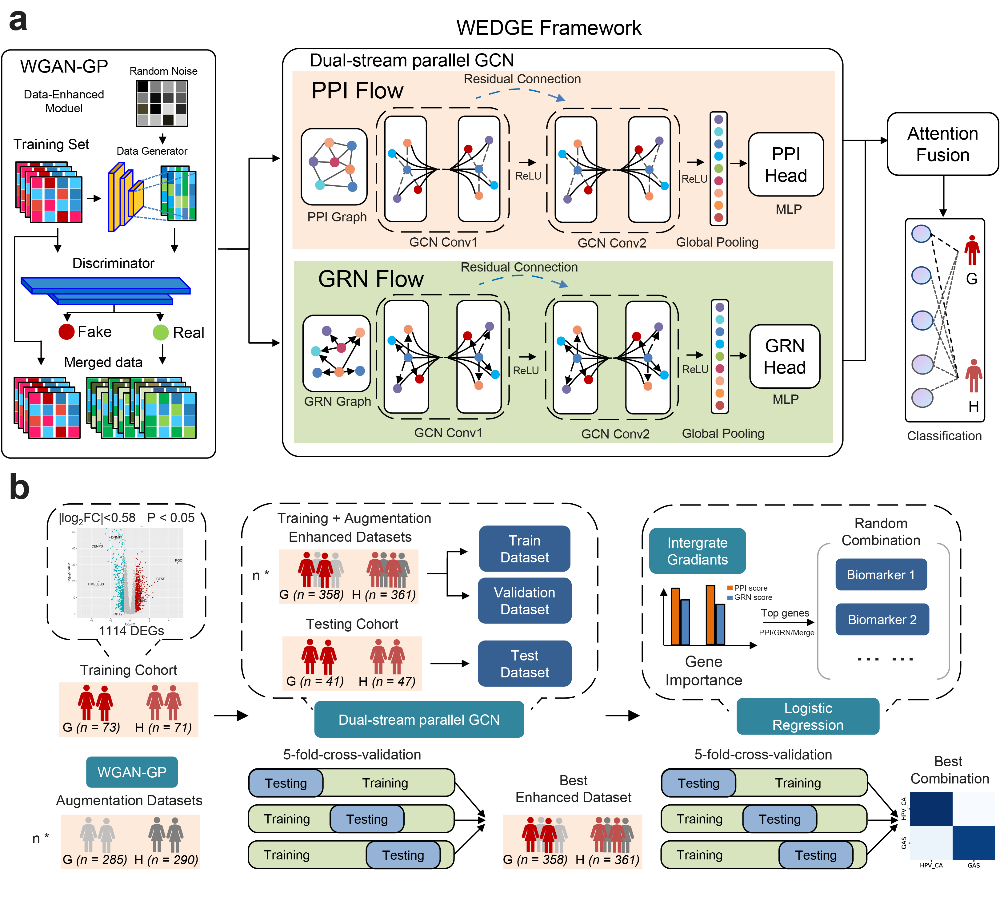

# WEDGE: Deep Learning-Enabled Proteomic Profiling for GAS Diagnosis

Official implementation of **WEDGE**, a deep learning framework for the proteomic diagnosis of Gastric-type Adenocarcinoma of the Uterine Cervix (GAS).

---

## Abstract

Gastric-type adenocarcinoma of the uterine cervix (GAS) is a rare, aggressive, HPV–independent malignancy. Diagnostic identification of GAS is challenged by its potential mimicry of benign cervical glands and morphological overlap with HPV-associated adenocarcinoma. Such ambiguities can lead to clinical misclassification, necessitating objective biomarkers to ensure accurate diagnosis. 

Here, we present the first comprehensive, multi-center proteomic analysis of GAS, profiling 407 cervical tissue samples to define its molecular landscape. To identify robust biomarkers, we developed **WEDGE**, a deep learning framework synergizing Wasserstein Generative Adversarial Networks (WGAN-GP) for data augmentation with biologically informed Dual-stream Graph Convolutional Networks (GCN). WEDGE identified a robust two-protein diagnostic panel, **Pepsinogen C (PGC)** and **DNA Methyltransferase 1 (DNMT1)**, which distinguished GAS from HPV-CA with **93% accuracy** in the test cohort and **97% accuracy** in an independent external validation cohort, significantly outperforming existing biomarker discovery methods. Immunohistochemical validation of PGC and DNMT1 confirmed expression patterns consistent with our proteomic findings and high diagnostic accuracy. Notably, we established PGC as an independent prognostic factor and integration of PGC with clinicopathological variables yielded a risk stratification model that significantly outperformed conventional clinical models in predicting patient outcomes. Collectively, our study establishes a novel AI-driven proteomic framework for biomarker discovery and provides clinically actionable diagnostic and prognostic biomarkers in GAS.

---

## Model Architecture

WEDGE utilizes a dual-stream Heterogeneous GCN to integrate:
1.  **Protein-Protein Interaction (PPI) stream** (String database).
2.  **Gene Regulatory Network (GRN) stream** (TRRUST database).

---

## System Requirements

### Hardware
* **CPU:** Standard desktop computer (minimum 16GB RAM recommended).
* **GPU:** NVIDIA GPU with 8GB+ VRAM (Optional, for faster inference/training).

### Software
* Python 3.8+
* **Dependencies:** (See `requirements.txt` for details)
    * `torch==2.1.0`
    * `pytorch-lightning==2.4.0`
    * `torch-geometric==2.6.1`
  
---

### Core Model Architecture & Training
* **`WEDGE_model.py`**: The heart of the framework. It defines the `HeteroGCN` and `GraphLevelHeteroGCN` (PyTorch Lightning) classes. It implements the dual-stream heterogeneous graph convolution logic, utilizing `HeteroConv` to process Protein-Protein Interaction (PPI) and Gene Regulatory Network (GRN) streams.
* **`Train.py`**: A wrapper for the PyTorch Lightning trainer. It manages essential training callbacks such as `ModelCheckpoint` for saving weights, `EarlyStopping` to prevent overfitting, and `LearningRateMonitor`.
---

### Data Engineering & Augmentation
* **`utilsdata.py`**: Contains the complete data pipeline, including matrix normalization, data splitting, and graph construction. Key functions include `getAdjByString` for adjacency matrix generation and `build_hetero_graph_dataset` for creating `HeteroData` objects.
* **`WGAN-GP/`**: A dedicated module for Wasserstein Generative Adversarial Networks with Gradient Penalty. This is used for clinical data augmentation to address the scarcity of GAS samples.
* **`PPI_GRN_database/`**: This directory stores the biological prior knowledge databases (e.g., STRING and TRRUST) used to construct the dual-stream graph networks.
---

### Evaluation & Model Interpretability
* **`Evaluation_of_WEDGE.py`**: The primary script for model evaluation. It orchestrates data loading, model initialization, and testing across different folds and cohorts.
* **`WEDGE_Explain.py`**: Implements the interpretability layer of the framework. It includes the `NodeImportanceAnalyzer` class, which utilizes **Integrated Gradients (IG)** and **Grad-CAM** to rank proteins based on their diagnostic contribution.
---

### Supporting Modules
* **`lib/checkpoints/`**: Storage for pre-trained model weights (`.ckpt`). The provided checkpoint allows for rapid reproduction of the results reported in the study.
* **`Compare/`**: Includes benchmark implementations of other biomarker discovery methods for performance comparison.
